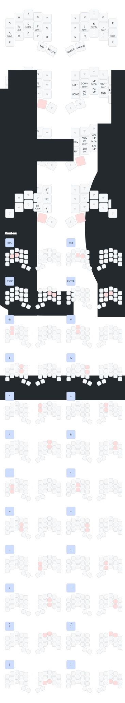

My keymap for programming and prose on a [Ferris Sweep](https://github.com/davidphilipbarr/Sweep).

- Symbol combos inspired by [urob's config](https://github.com/urob/zmk-config).
- Prefers cross-hand modifiers like [miryoku](https://github.com/manna-harbour/miryoku_zmk).

