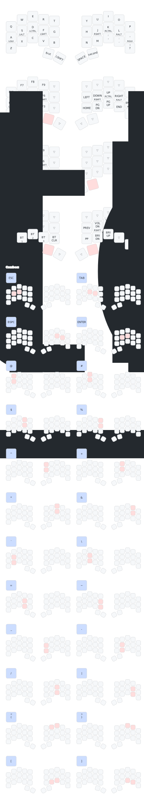

My keymap for programming and prose on a [Ferris Sweep](https://github.com/davidphilipbarr/Sweep).

- Symbol combos and homerow mods inspired by [urob](https://github.com/urob/zmk-config)
- Prefers cross-hand modifiers like [miryoku](https://github.com/manna-harbour/miryoku_zmk)
- Keymap rendered by [keymap-drawer](https://github.com/caksoylar/keymap-drawer)

